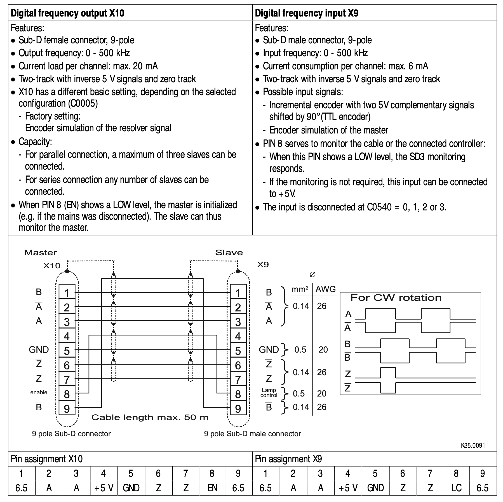
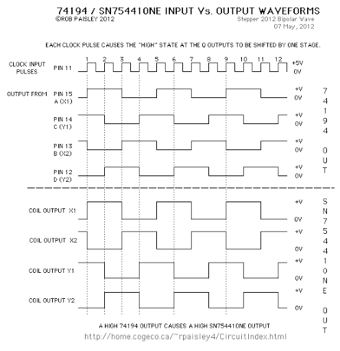

# Motor Controller
The motors are controlled by lenze servo controllers. All of the servo drives and the power management are already packed in a nice cabinet. This will be reused. Here the teensy will be sitting inside this cabinet. The model of the servo controllers is Lenze 9300. Here the X9 and X10 connectors will be used as seen here:

*Figure 1: Page 47 of lenze 9300 servodrive manual*

*__Lenze manual:  [BA_9300_Register_control_EN.pdf](/md_attachments/BA_9300_Register_control_EN.pdf)__*

Here the X9 connector is digital frequency input. This input requires a TTL encoder signal. Then the servo drive will mimic this encoder signal. This way the drive can be controlled. So the Teensy 4.0 will input the Marlin stepper signals to this input. The plan is to have 4 outputs on the teensy that, so the X,Y,Z,W axisses can be controlled. Here the W axis is the motor that turns the extruder. Another nice feature this allows is that the servo drives can easily be daisy chained if multiple motors is needed per axis by connecting the X10 and X9. 

As seen in figure 2, non-inverting- and inverting bus-trancievers are used to unload the teensy's output GPIO pins. The reason the inverting bus-trancievers are used is because the input signal is differential as seen in figure 1. 

The reason why the stepper output of Duet can be connected directly to the TTL encoder signal of the X9 input is because the signals are identical as seen by comparing Figure 1 and Figure 4 below:

*Figure 4: Here is seen the stepper output duet*

Here it should be noted that the Z signal is not necessary to use, so it will not be used. The z signal just signifies when the encoder has turned one revolution. This will not be relevant though since all stepping amounts will be calibrated in duet software at last.

#### The cable between X9 and X10

As seen in figure 1 there are specific requirements for the specific leaders in the cable that is going to run between x9 and x10. Here there have been chosen a 9-conductor cable at 0.5mm2. The connectors are going to be female-female, so there have been chosen some 9-pin d-sub connectors. The links for the parts can be seen in the BoM

### Bill of Materials

| Name                  | Quantity |                             Link                             | Price(DKK) |
| :-------------------- | :------: | :----------------------------------------------------------: | :--------: |
| Cable                 |    1     |   [Link](https://dk.rs-online.com/web/p/yy-kabel/1811780/)   |    589     |
| D-sub Connector       |    16    |  [Link](https://dk.rs-online.com/web/p/d-sub-stik/5443749/)  |   6.376    |
| D-sub Connector house |    16    | [Link](https://dk.rs-online.com/web/p/d-sub-bagkapper/5444039/) |   27.22    |
| SN74LS640N            |    6     | [Link](https://www.ti.com/store/ti/en/p/product/?p=SN74LS640N) |    9.54    |
| SN74ABT245BN          |    6     | [Link](https://www.ti.com/store/ti/en/p/product/?p=SN74ABT245BN) |    4.52    |

